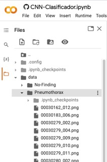

## Instalación de dependencias

```{r}
install <- F
if (install==T){
install.packages("keras")
install.packages("httr")
install.packages("tidyverse")
install.packages("rmarkdown")
install.packages("reshape2")
install.packages("patchwork")

}
```

## Carga de dependencias

Lo primero que debemos hacer es cargar las dependencias (librerías) que vamos a necesitar en nuestro análisis. El paquete de R más representativo de este conjunto de dependencias es [Keras](https://keras.io/). En este [post]() ya comentamos sobre el uso de Keras como framework de Deep Learning.

```{r}
library(tidyverse)
library(httr)
library(rmarkdown)
library(keras)
library(reshape2)
library(patchwork)

```

## Acceso a datos

*Esta sección solo es importante para aquellos usuarios que deseen ejecutar el código en Google Colab*

Para ejecutar este Notebook en (Google Colab)[<https://colab.research.google.com/>] debemos de importar los datos al espacio local de trabajo de Colab. Los pasos son los siguientes:

1.  Accedemos a la [siguiente dirección](https://drive.google.com/drive/folders/1jZkgiSgT7ab_wQynxtkY4QpIxljbsWvi?usp=sharing) en Google Drive y descargamos el directorio comprimido de los datos.

2.  Descomprimimos el directorio en nuestro ordenador local.

3.  Creamos unos directorios en Google Colab para guardar los datos de las imágenes.

```{r}

#Creamos directorios locales
system("mkdir data")
system("mkdir data/Pneumothorax")
system("mkdir data/No-Finding")

```

4.  Subimos manualmente los ficheros de imagen de acuerdo a la organización de cada carperta a Google Colab. Para ello, hacemos clic con botón derecho sobre cada una de los nuevos directorios en Colab y subimos las imágenes correspondientes.

Una vez subidos los ficheros debemos de ver algo tal que así en Google Colab.

Ejemplo de imágenes de datos: 

**NOTA IMPORTANTE**

LAS IMÁGENES DE ENTRENAMIENTO Y TEST OCUPAN UN VOLUMEN EN DISCO DE 25GB DEBIDO A SU ELEVADO NUMERO. EL USUARIO HA DE TENER EN CUENTA LOS TIEMPOS DE CARGA Y DESCARGA ASÍ COMO QUE ES POSIBLE QUE NO PUEDA CARGARLAS TODAS EN COLAB. CUANTAS MENOS IMAGENES SE CARGUEN EN COLAB PEORES SERAN LOS RESULTADOS DE LOS ENTRENAMIENTOS Y LAS PREDICCIONES.

# Lectura de datos

Utilizando esta función leemos y preprocesamos todas las imágenes con las que vamos a querer trabajar. Esta función procede del [post original](https://rpubs.com/spalladino14/653239) escrita por [Spencer Palladino](https://www.linkedin.com/in/spencer-palladino/).

```{r}
process_pix <- function(lsf) {
  img <- lapply(lsf, image_load, color_mode = "grayscale") # grayscale the image
  arr <- lapply(img, image_to_array) # turns it into an array
  arr_resized <- lapply(arr, image_array_resize, 
                        height = 100, 
                        width = 100) # resize
  arr_normalized <- normalize(arr_resized, axis = 1) #normalize to make small numbers 
  return(arr_normalized)
}
```

En este fragmento de código cargamos las imágenes desde de los directorios donde las hemos dejado previamente.

```{r eval = TRUE}
lsf <- list.files("./data/Pneumothorax", full.names = TRUE) 

lsf2 <- lsf[1:length(lsf)]
dissease <- process_pix(lsf2)

dissease <- dissease[,,,1]
dissease_reshaped <- array_reshape(dissease, c(nrow(dissease), 100*100))

# Imágenes de personas SIN patologías
lsf3 <- list.files("./data/No-Finding", full.names = TRUE) 

lsf4 <- lsf3[1:length(lsf3)]

ndissease <- process_pix(lsf4)
ndissease  <- ndissease[,,,1]
ndissease_reshaped <- array_reshape(ndissease, c(nrow(ndissease), 100*100))
```

Tenemos `r nrow(dissease_reshaped)` imágenes de rayos-x de personas con enfermedad y `r nrow(dissease_reshaped)` imágenes de personas sin enfermedad.

# Visualización previa de los datos/imágenes

```{r}
scandissease <- reshape2::melt(dissease[10,,])
plotdissease <- scandissease %>%
  ggplot() +
  aes(x = Var1, y = Var2, fill = value) + 
  geom_raster() +
  labs(x = NULL, y = NULL, title = "Raxos-x de personas con enfermedad") + 
  scale_fill_viridis_c() + 
  theme(legend.position = "none")

scanndissease <- reshape2::melt(ndissease[10,,])
plotndissease <- scanndissease %>%
  ggplot() +
  aes(x = Var1, y = Var2, fill = value) + 
  geom_raster() +
  labs(x = NULL, y = NULL, title = "Raxos-x de personas sin enfermedad") + 
  scale_fill_viridis_c() + 
  theme(legend.position = "none")


plotdissease + plotndissease
```

# Comenzamos el análisis

Lo primero que vamos a hacer es mezclar las imágenes de pacientes con enfermedad y sin ella.

```{r}
df <- rbind(cbind(dissease_reshaped, 1), # 1 = dissease
            cbind(ndissease_reshaped, 0)) # 0 = no dissease
set.seed(1234)
shuffle <- sample(nrow(df), replace = F)
df <- df[shuffle, ]
```

# El modelo: Convolutional neural network (CNN)

Lo primero que hacemos dividir el conjunto total de imágenes en dos conjuntos siguiendo la proporción (80%/20%). Es decir, vamos a entrenar el algoritmo con el 80% de las imágenes y validarlo con el 20% restante.

```{r}
set.seed(2022)
split <- sample(2, nrow(df), replace = T, prob = c(0.8, 0.2))
train <- df[split == 1,]
test <- df[split == 2,]
train_target <- df[split == 1, 10001] # label in training dataset
test_target <- df[split == 2, 10001] # label in testing dataset
```

Convertimos las etiquetas de enfermedad/no-enfermedad a un tipo de datos de tipo factor o categórico.

```{r}
train_label <- to_categorical(train_target)
test_label <- to_categorical(test_target)
```


# El modelo pre-entrenado: Convolutional neural network (CNN)

Lo primero que hacemos es cargar un modelo pre-entrenado con 1500 imágenes de cada tipo. El entrenamiento de este modelo con esa cantidad tan grande imágenes requiere de una gran cantidad de espacio en disco para el almacenamiento de las imágenes además de alta potencia de cálculo en términos de CPU y memoria RAM. Por este motivo, para permitir al usuario ejecutar este notebook y comprobar los resultados del modelo debemos de partir de un modelo previamente entrenado. Si optaramos por reducir significativamente el número de imágenes de entrenamiento, la precisión del modelo decae rápidamente.

```{r}
#model <- load_model_tf("./model/disseasemodel/")

model <- load_model_hdf5("./model/disseasemodel/")
```

Una vez cargado el modelo entrenado, vamos a intentar hacer un ajuste sobre el 20% de los datos que dejamos para test.

```{r}
fit_dissease <- model %>%
  fit(x = train,
      y = train_label, 
      epochs = 25,
      batch_size = 512, # try also 256, 512
      verbose = 2,
      validation_split = 0.2)
```

Una visualización rápida sobre como se comporta el algoritmo sobre las imágenes que hemos reservado para validar.

```{r}
plot(fit_dissease)
```

Calculamos las métricas de rendimiento del algoritmo.

```{r}
model %>%
  evaluate(test, test_label)
```

Hacemos ahora algunas predicciones sobre imágenes de pacientes. Es decir, una vez entrenado y validado el algoritmo, nos preguntamos como va a clasificar las imágenes que le vamos a dar ahora. Como sabemos "la verdad" (lo que se denomina el ground truth) sobre las imágenes, comparamos el resultado de la predicción con la verdad. Para comprobar los resultados de la predicción (que variarán en función del número de imágenes que se usen en el entrenamiento) se utiliza lo que en ciencia de datos se denomina la matriz de confusión. La matriz de confusión:

-   coloca en la posición 1,1 los casos que SI tenían enfermedad y el modelo clasifica como "con enfermedad"
-   coloca en la posición 2,2, los casos que NO tenían enfermedad y el modelo clasifica como "sin enfermedad"

Es decir, estas son las posiciones en las que el modelo "acierta" en su clasificación.

En las posiciones contrarias, es decir, la 1,2 y la 2,1 son las posiciones en las que el modelo se "equivoca". Así, la 1,2 son los resultados que el modelo clasifica como CON enfermedad y la realidad es que eran pacientes sanos. La posición 2,1 justo lo contrario.

```{r}
predictedclasses <- model %>%
  predict(test) %>% `>`(0.5) %>% k_cast("int32")
table(Prediction = as.numeric(predictedclasses[,2]), Truth = test_target)
```


# Conclusiones

Hemos entrenado una algoritmo de tipo CNN Convolutional neural network-CNN para realizar clasificaciones binarias (enfermo vs no-enfermo) sobre un conjunto de imágenes de rayos-x de pecho tanto de pacientes sanos como de pacientes con varias patologías. Por sencillez, hemos escogido pacientes sanos y pacientes que presentan un Pneumothorax previamente identificado por un médico. El resultado del entrenamiento nos ofrece un algoritmo de clasificación robusto para el screening automático.
